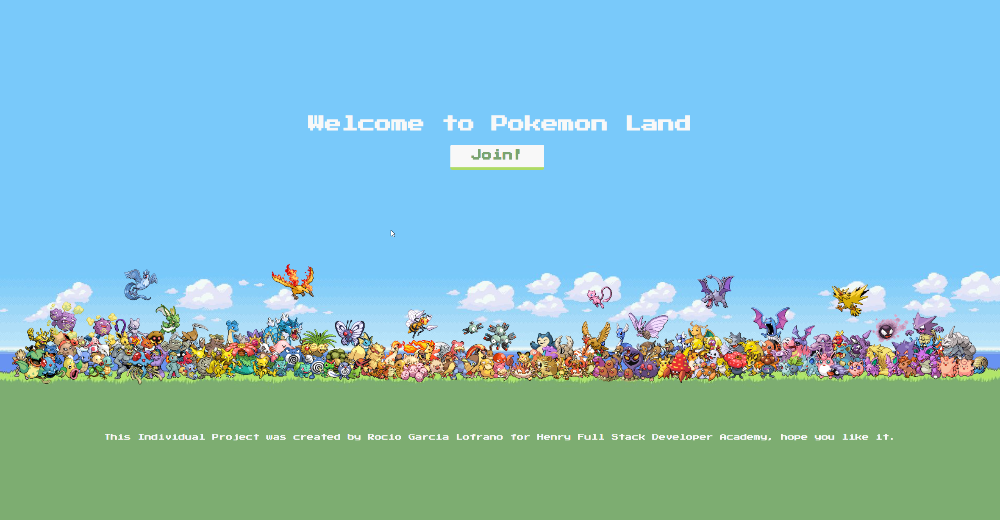
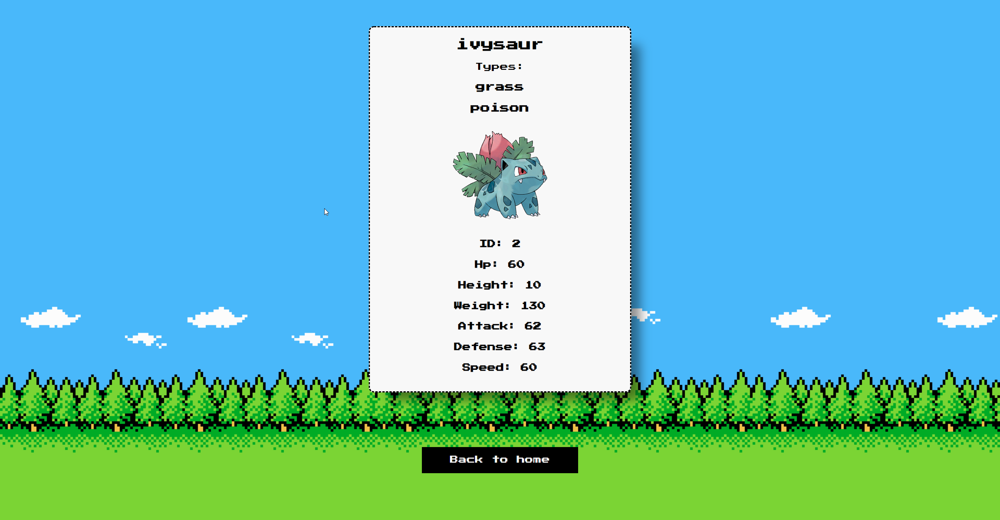

    

- Individual project (SPA: Single Page Application) made for the academy soyHenry. It is titled "PokeLand".

  

  

  

  

## Project Objectives

- Build an App using React, Redux, Node and Sequelize.
- Affirm and connect the concepts learned in the race.
- Learn best practices.
- Learn and practice the GIT workflow.
- Use and practice testing.

## Statement

Create an application in which you can see the different Pokemon using the external api [pokeapi](https://pokeapi.co/) and from there you can, among other things:

- Search pokemon
- Filter / Sort them
- Create new pokemons

### Endpoints used

- https://pokeapi.co/api/v2/pokemon
- https://pokeapi.co/api/v2/pokemon/{id}
- https://pokeapi.co/api/v2/pokemon/{name}
- https://pokeapi.co/api/v2/type

#### Tecnologies used:

- [ ] React
- [ ] Redux
- [ ] Express
- [ ] Sequelize - Postgres
- [ ] CSS

- Thank you for getting here!
